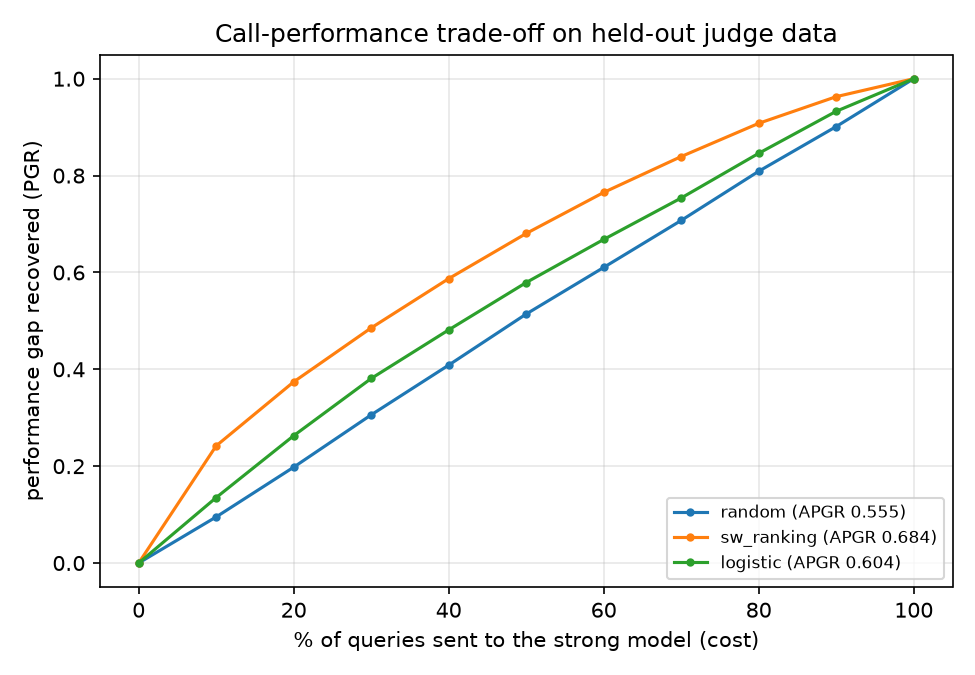

# LLM Router

Not every query needs an expensive model. This project trains a **router** that
reads a query and predicts whether a cheap model will be good enough - so you
pay for the expensive model only when it actually earns its price.

It is a from-scratch implementation of
**[RouteLLM: Learning to Route LLMs with Preference Data](https://arxiv.org/abs/2406.18665)**
(Ong et al., ICLR 2025), trained on real human preference data.

```
                        ┌──────────────────────────────┐
  user query ─────────► │  router: P(strong is needed) │
                        └──────────────┬───────────────┘
                                       │  score >= alpha ?
                        ┌──────────────┴───────────────┐
                        ▼                              ▼
              strong model (GPT-4 class)      weak model (Mixtral class)
                 ~$25 / M tokens                 ~$0.24 / M tokens
```

The router sees **only the query**. It never sees a model's answer, because at
serving time no answer exists yet - asking both models and picking the better
reply would cost more than always using the expensive one.

`alpha` is the cost dial. Raising it sends fewer queries to the strong model:
cheaper, slightly worse. You pick it from a budget, not by guesswork
(`metrics.threshold_for_cost`).

## Results

Trained on 50,746 preference pairs (11k Arena + 40k GPT-4-judge), evaluated on
9,989 held-out judge prompts. The cheap model alone scores 0.854 on this set;
the strong model is the reference at 1.000.

| Router | APGR | vs random | CPT(50%) | CPT(80%) | cost saving at PGR 0.5 |
|---|---|---|---|---|---|
| `random` | 0.555 | 0.0% | 49% | 79% | 2.0x |
| `sw_ranking` | 0.684 | +23.3% | 32% | 65% | 3.1x |
| `logistic` | 0.604 | +8.8% | 42% | 76% | 2.3x |

**Read the table like this:** `sw_ranking` recovers half the quality gap while
sending only **32%** of queries to the expensive model, where routing at random
needs **49%**. At the paper's prices ($24.70 vs $0.24 per million tokens) that is
**3.0x cheaper than sending everything to the strong model**, for half the gap
closed.



The curve is figure 1 of the paper, reproduced on this data: cost on the x-axis,
quality recovered on the y-axis. Random is the diagonal; a useful router bulges
above it.

### Routing decisions (`python scripts/demo.py`)

```
budget = 30% of traffic to the strong model  ->  alpha = 0.3522

 score  route to  prompt
 0.295  weak      What is the capital of France?
 0.350  weak      Translate 'good morning' into Spanish.
 0.212  weak      Write a haiku about coffee.
 0.300  weak      Summarise the following in one sentence: the meeting was postponed to Fri...
 0.399  STRONG    Prove that there are infinitely many primes of the form 4k+3.
 0.450  STRONG    Here is a 300-line Python traceback about a circular import in a Django a...
 0.327  weak      Design a rate limiter for a distributed API with per-tenant quotas, and e...
 0.451  STRONG    Derive the gradient of the softmax cross-entropy loss with respect to the...

38% routed to the strong model | 35 ms for 8 decisions (4.4 ms each, embedding included)
```

A routing decision costs **~4.4 ms**, almost all of it the embedding. That is the
overhead the paper measures in table 7, and it is negligible next to an LLM call.

**Note on alpha.** A raw score of 0.5 means nothing here: most training prompts
did not need the strong model, so scores cluster low. You set alpha from a
budget - "30% of traffic may go to GPT-4" - and `threshold_for_cost` converts
that budget into the matching threshold.

## How it works

**1. Labels from preference data** (`llm_router/data.py`)

Two public datasets are reduced to a single target `y = P(strong model needed)`,
where `1.0` = the strong model's answer was better, `0.5` = equivalent,
`0.0` = the cheap model was good enough.

| Source | What it is | Labelled by |
|---|---|---|
| [Chatbot Arena 55k](https://huggingface.co/datasets/lmarena-ai/arena-human-preference-55k) | real battles between 64 models | the human who asked |
| [RouteLLM gpt4_dataset](https://huggingface.co/datasets/routellm/gpt4_dataset) | Nectar prompts, GPT-4 vs Mixtral | GPT-4 as judge (1-5) |

*Why tiers?* Labels for any **specific** model pair are hopelessly sparse: only
378 of 57,477 Arena battles (0.66%) are GPT-4 vs Mixtral, and the average model
pair covers 0.078% of the data. Grouping models into the paper's quality tiers
(Appendix A) and learning **strong tier vs weak tier** turns those 378 battles
into **11,281** training pairs.

**2. Embeddings** (`llm_router/embeddings.py`) - prompts become 384-dim vectors
from `all-MiniLM-L6-v2`, cached on disk. The paper used OpenAI's
`text-embedding-3-small`; a local model keeps the whole pipeline free and offline.

**3. Routers** (`llm_router/routers.py`)

| Router | Idea | Training |
|---|---|---|
| `random` | ignore the query, route a fixed share at random | none - the baseline to beat |
| `sw_ranking` | similarity-weighted Bradley-Terry (paper eq. 9-10): the weighted mean label of the nearest training queries | none, all work at inference |
| `logistic` | logistic regression on frozen embeddings, trained with eq. 10's cross-entropy on soft labels | seconds on a laptop |

`logistic` stands in for the paper's BERT and Llama-3-8B routers, which need
2x24GB and 8xA100 GPUs. Here the encoder is frozen and only the final layer is
trained - same idea, a fraction of the capacity.

**4. Metrics** (`llm_router/metrics.py`) - accuracy is the wrong metric: ~86% of
prompts do not need the strong model, so "always use the cheap one" scores 86%
while failing every hard query. The paper's metrics measure the trade-off instead:

- **PGR** - performance gap recovered (eq. 6). 0 = as bad as the cheap model alone, 1 = as good as the expensive one.
- **APGR** - PGR averaged over all cost levels (eq. 7-8). One number per router.
- **CPT(x%)** - the smallest share of expensive calls needed to reach PGR = x. Lower is better.

## Run it

```bash
python3.11 -m venv .venv && source .venv/bin/activate
pip install -r requirements.txt

# 1. download the two datasets (~265MB) into data/
bash scripts/download_data.sh

# 2. build the training and eval tables
python scripts/build_dataset.py

# 3. train every router and write results/ + models/
python scripts/train_eval.py

# 4. see routing decisions on example prompts (no API key needed)
python scripts/demo.py

# 5. serve it
uvicorn llm_router.server:app --reload
curl -s localhost:8000/route -H 'content-type: application/json' \
  -d '{"prompt":"Prove there are infinitely many primes of the form 4k+3."}'
```

`POST /route` returns the decision only and never calls an LLM.
`POST /v1/chat/completions` is OpenAI-compatible: it routes, then answers with
the chosen model - returning a clearly-labelled mock reply when no
`OPENAI_API_KEY` is set, so the service is demonstrable offline.

```bash
pytest          # label-flipping and metric tests
```

## Honest limitations

- **Evaluation is a proxy.** The paper scores routers on MT-Bench, MMLU and
  GSM8K, where both models' answers are graded. Running those needs API credits,
  so routers here are scored on the judge dataset's held-out split, using the
  judge's 1-5 score as the cheap model's quality. That measures ranking ability
  on in-distribution data, and it flatters the router compared with a true
  out-of-distribution benchmark.
- **The strong model's quality is assumed to be 1.0**, since it is the judge's
  reference answer. Real benchmarks would score it too.
- **No matrix-factorization or fine-tuned BERT router yet** - the two that
  performed best in the paper.
- **Judge labels inherit GPT-4's biases**, including a preference for its own
  style and for longer answers. In the Arena data, the longer reply wins 61.6%
  of non-tie votes.

## Layout

```
llm_router/
  data.py         preference datasets -> (prompt, y)
  embeddings.py   cached sentence embeddings
  routers.py      random / sw_ranking / logistic
  metrics.py      PGR, APGR, CPT
  server.py       FastAPI: /route and /v1/chat/completions
scripts/
  download_data.sh, build_dataset.py, train_eval.py, demo.py, explore_data.py
tests/            label logic and metric tests
```
